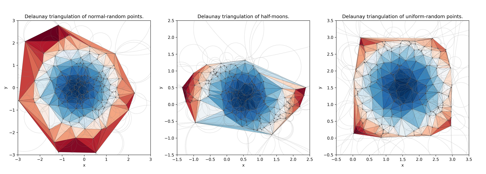

# Torch Delaunay - The Delaunay triangulation library for PyTorch

This is a fast library for computing [Delaunay triangulation](https://en.wikipedia.org/wiki/Delaunay_triangulation)
of 2-dimensional points.

The implementation is based on a sweep-algorithm, introduced by David Sinclair[^1] and later
improved by Volodymyr Agafonkin[^2].

Here is an example of triangulation output produced by Torch Delaunay library for a random set of
points:


## Installation

The library is distributed as PyPI package, to install the package, execute the following
command:
```sh
pip install torch_delaunay
```

You can use the `torch_delaunay` library for a fast computation of Delaunay triangulation for
points defined as [PyTorch](https://pytorch.org) tensors.

## Usage

```py
import torch
from torch_delaunay.functional import shull2d
import matplotlib.pyplot as plt

# Compute Delaunay triangulation for randomly-generated 2-dimensional points.
points = torch.rand((100, 2))
simplices = shull2d(points)

plt.triplot(points.cpu().numpy()[:,0], points.cpu().numpy()[:,1], triangles=simplices.cpu().numpy())
plt.title('Delaunay Triangulation')
plt.show()
```

## Benchmarks

Benchmarks are collected on _Apple M1 Pro_ chip with 32 GiB of memory.

| Prob. Distribution | Data Type | Samples | Time     | CPU      | Iterations |
| ------------------ | --------- | ------- | -------- | -------- | ---------- |
| Uniform            | Float64   | 10000   |  4.18 ms |  4.11 ms |        171 |
| Uniform            | Float64   | 100000  |  49.6 ms |  48.3 ms |         15 |
| Uniform            | Float64   | 1000000 |   600 ms |   592 ms |          1 |
| Uniform            | Float32   | 10000   |  4.37 ms |  4.29 ms |        161 |
| Uniform            | Float32   | 100000  |  47.4 ms |  46.4 ms |         15 |
| Uniform            | Float32   | 1000000 |   573 ms |   568 ms |          1 |
| Normal             | Float64   | 10000   |  4.60 ms |  4.49 ms |        156 |
| Normal             | Float64   | 100000  |  48.5 ms |  47.4 ms |         15 |
| Normal             | Float64   | 1000000 |   568 ms |   563 ms |          1 |
| Normal             | Float32   | 10000   |  4.42 ms |  4.33 ms |        165 |
| Normal             | Float32   | 100000  |  46.5 ms |  45.4 ms |         15 |
| Normal             | Float32   | 1000000 |   550 ms |   547 ms |          1 |

## License

The Torch Delaunay is distributed under GPLv3 license. See the [LICENSE](LICENSE) file for full
license text.


[^1]: David Sinclair - [S-hull: a fast radial sweep-hull routine for Delaunay triangulation](https://arxiv.org/abs/1604.01428).

[^2]: Volodymyr Agafonkin - [Delaunator: An incredibly fast and robust JavaScript library for Delaunay triangulation of 2D points](https://github.com/mapbox/delaunator).
